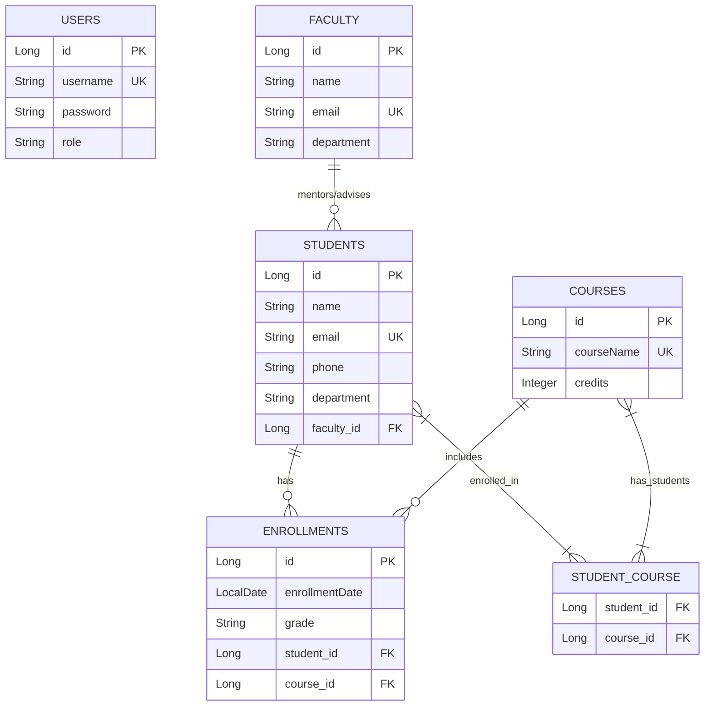
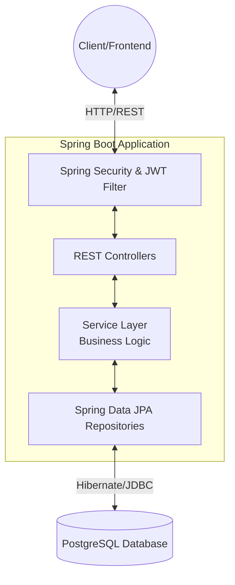
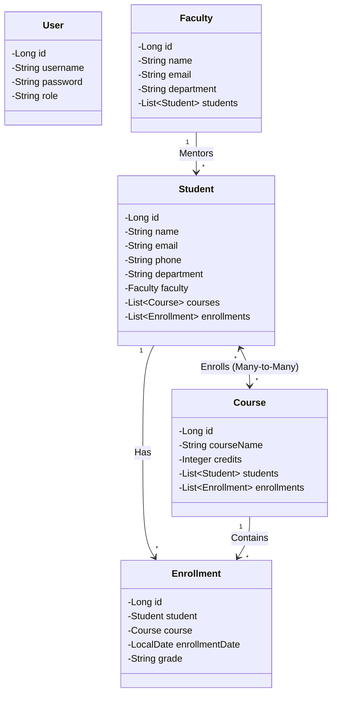

# University Portal Backend

A robust Spring Boot backend application designed to manage university operations, including student enrollments, faculty assignments, and course management. 

## 🚀 Features
- **Student Management:** Create, read, update, and delete student records.
- **Course Management:** Manage course offerings and credits.
- **Faculty Management:** Assign and track faculty members and their departments.
- **Enrollment System:** Handle student enrollments into specific courses with grades and dates.
- **Security:** JWT-based authentication for secure API access.
- **API Documentation:** Interactive Swagger UI for testing endpoints.

## 🛠️ Technology Stack
- **Java 25**
- **Spring Boot 4.1.0** (WebMVC, Data JPA, Security, Validation)
- **PostgreSQL** (Database)
- **JJWT** (JSON Web Tokens)
- **Springdoc OpenAPI** (Swagger Documentation)
- **Maven** (Build Tool)

## 📊 Database Entity-Relationship (ER) Diagram

The system's database schema revolves around core entities for the university portal. Note that a student can have a direct many-to-many relationship with courses, as well as an explicit `Enrollment` record for tracking grades and dates.



## 🏗️ System Architecture

The application follows a standard layered monolithic architecture, ensuring separation of concerns:



## 🧩 Class Architecture

The internal class structure of the core domain entities:



## ⚙️ Setup and Installation

### Prerequisites
- Java 25 installed
- PostgreSQL server running locally or remotely
- Maven

### Configuration
1. Open `src/main/resources/application.properties`.
2. Configure your database and JWT secrets. The application expects these as environment variables:
   - `DB_PASSWORD`
   - `JWT_SECRET`
   
   *Alternatively, replace `${DB_PASSWORD}` and `${JWT_SECRET}` in the properties file with your actual values for local development.*

### Running the Application
1. Open a terminal in the project root directory.
2. Build and run the project using the Maven wrapper:
   ```bash
   ./mvnw spring-boot:run
   ```
3. The server will start on port `8081`.

## 📚 API Documentation
Once the application is running, you can interact with the API endpoints via the Swagger UI:
- **Swagger URL:** [http://localhost:8081/swagger-ui/index.html](http://localhost:8081/swagger-ui/index.html)
